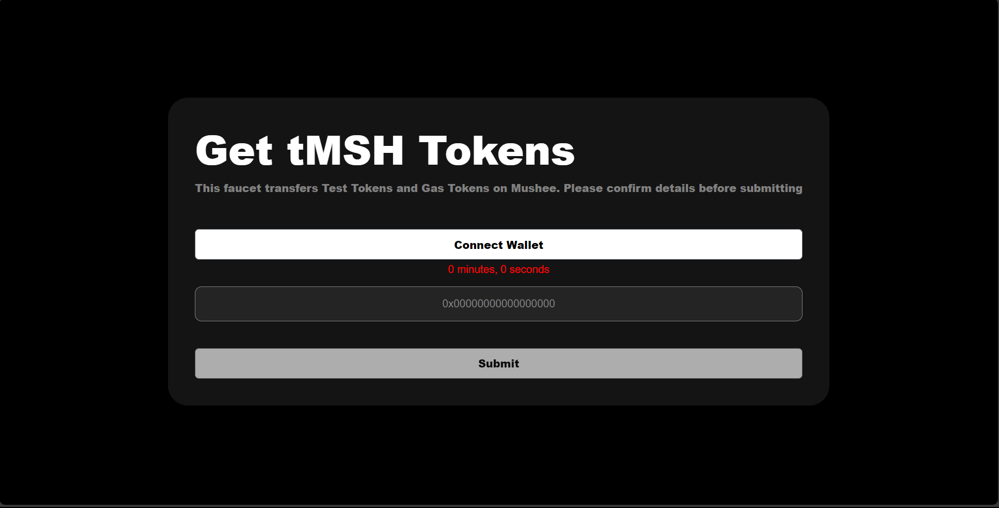

# Faucet Tokens

This React component, `FaucetContainer`, is a part of a project related to handling and distributing test tokens on a testnet blockchain, presumably using MetaMask or a similar wallet.



## Environment Variables

The component utilizes several environment variables loaded from the Vite environment:

- `CRYPTO_NAME`: The name of the cryptocurrency.
- `SYMBOL`: The symbol representing the cryptocurrency.
- `CHAIN_ID`: The ID of the blockchain chain.
- `CHAIN_NAME`: The name of the blockchain chain.
- `DECIMALS`: The number of decimals for the cryptocurrency.
- `RPC_URLS`: The RPC (Remote Procedure Call) URLs for the blockchain.
- `BLOCK_EXPLORER_URLS`: The block explorer URLs for the blockchain.
- `ADDRESS`: The faucet address for distributing test tokens.

These variables are used to form a `TESTNET_INFORMATION` object, containing information about the testnet, including chain details, native currency, RPC URLs, and block explorer URLs.

## Functionalities

1. **Contract Initialization:**
   - Initializes a contract instance using the provided ABI and faucet address.
   - Handles errors, informing the user to ensure MetaMask is installed.

2. **Wallet Connection:**
   - Connects the wallet (MetaMask or BinanceChain) and adds the Ethereum chain.
   - Retrieves the connected accounts and displays success or error messages accordingly.

3. **Request Tokens:**
   - Requests test tokens from the faucet by calling the `requestTokens` function in the smart contract.
   - Updates the cool down time for the requesting address.
   - Displays success or error messages.

4. **Cool down Time:**
   - Retrieves and displays the cool down time for a given address.

5. **Copy to Clipboard:**
   - Copies the connected wallet address to the clipboard.

## Components and Libraries

- **Web3:** Utilizes the Web3 library to interact with the Ethereum blockchain.
- **Yup:** Defines a validation schema for the form using Yup.
- **Swal (SweetAlert):** Displays user-friendly alerts for success and error messages.
- **Countdown:** Renders a countdown timer, presumably indicating the remaining cool down time.

## Usage

This component can be integrated into a larger application to provide a user interface for requesting and managing test tokens on a testnet blockchain. It leverages MetaMask or BinanceChain for wallet interactions and provides a straightforward process for users to connect their wallets, request tokens, and view relevant information.

This guide provides step-by-step instructions on setting up and using the Test Token Faucet program. The program allows users to request and manage test tokens on a testnet blockchain using MetaMask or BinanceChain.

## Setup

### 1. Clone the Repository

Clone the repository containing the Test Token Faucet program to your local machine:

```bash
    git clone https://github.com/nnoromiv/crypto_faucet.git
```

### 2. Install Dependencies

```shell
    cd crypto_faucet
    npm install
```

### 3. Environment Variables

Create a .env file in the root of the project and set the following environment variables:

```bash
   VITE_CRYPTO_NAME=YourCryptoName
   VITE_CRYPTO_SYMBOL=YourSymbol
   VITE_CHAIN_ID=YourChainId
   VITE_CHAIN_NAME=YourChainName
   VITE_DECIMALS=YourDecimals
   VITE_RPC_URLS=YourRpcUrls
   VITE_BLOCK_EXPLORER_URLS=YourBlockExplorerUrls
   VITE_FAUCET_ADDRESS=YourFaucetAddress
```

### 4. Customize

Go to the contract folder and customize your token information.

### 5. Run the Development Server

```bash
    npm run dev
```

## More on Usage

### 1. Connect Wallet

- Open the Test Token Faucet application in your web browser.
- Click on the "Connect Wallet" button.
If using MetaMask:
- Ensure MetaMask is installed.
- Confirm the connection request.
If using BinanceChain:
- Ensure the BinanceChain wallet is available.
- Confirm the connection request.

### 2. Copy Wallet Address

- Once connected, your wallet address will be displayed. Click on the displayed address to copy it to the clipboard.

### 3. Request Test Tokens

- Enter an Ethereum address in the provided form.
- Click the "Submit" button to request test tokens.
- The program will display success or error messages based on the request.

### 4. Check Cool down Time

- It is Automatically displayed for the connected wallet.

## Troubleshooting

If you encounter any issues during setup or usage, refer to the error messages displayed by the application. Ensure that MetaMask or BinanceChain is properly configured and that your environment variables are correctly set.

For additional support, please check the project's GitHub repository for documentation and issue tracking.

Now you're ready to use the Test Token Faucet to request and manage test tokens on your chosen testnet blockchain!
